# AirBooking - Full Stack Flight Booking Platform

<div align="center">


A comprehensive flight booking platform demonstrating full-stack development capabilities with Django REST Framework and React. The system features user approval workflows, real-time flight status updates, and secure authentication.

[Features](#-key-features) • [Tech Stack](#-tech-stack) • [Installation](#-installation-guide) • [Configuration](#-environment-configuration) • [Usage](#-usage-instructions) • [API Documentation](#-api-documentation) • [Database](#-database-schema) • [Testing](#-testing--admin-credentials) • [License](#license)

</div>

---

## Table of Contents

- [Project Overview](#-project-overview)
- [Key Features](#-key-features)
- [Tech Stack](#-tech-stack)
- [External APIs](#-external-apis)
- [Installation Guide](#-installation-guide)
- [Environment Configuration](#-environment-configuration)
- [Usage Instructions](#-usage-instructions)
- [API Documentation](#-api-documentation)
- [Database Schema](#-database-schema)
- [Testing & Admin Credentials](#-testing--admin-credentials)
- [Security Considerations](#-security-considerations)
- [Contributing](#-contributing)
- [License](#license)

---

##  Project Overview

AirBooking is a full-stack flight reservation system that demonstrates comprehensive capabilities across backend API development, frontend user interfaces, and database design. The platform implements a user approval workflow, real-time flight status tracking, and secure JWT-based authentication with OTP-based password reset.

## Screenshots

### User Side

#### Landing Page  
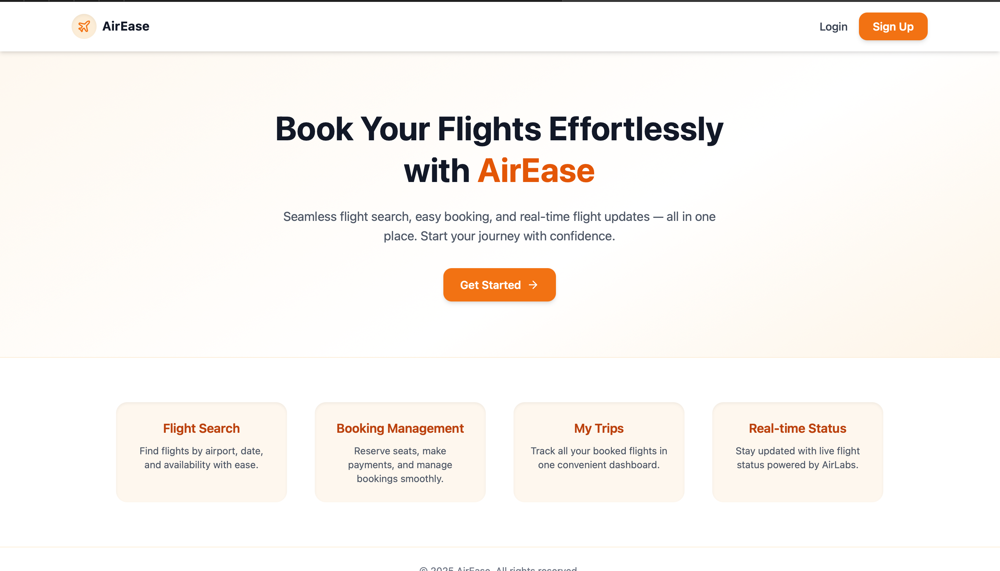  

#### Login Page  
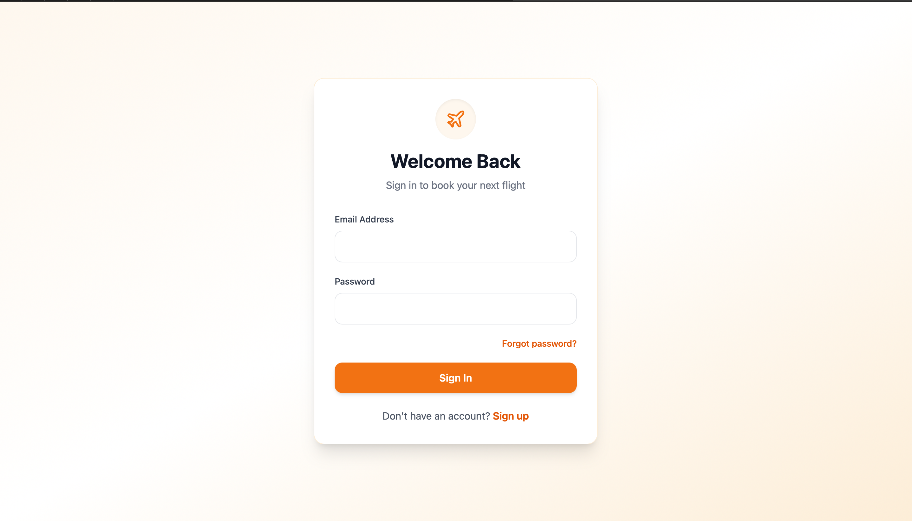

#### Register Page  
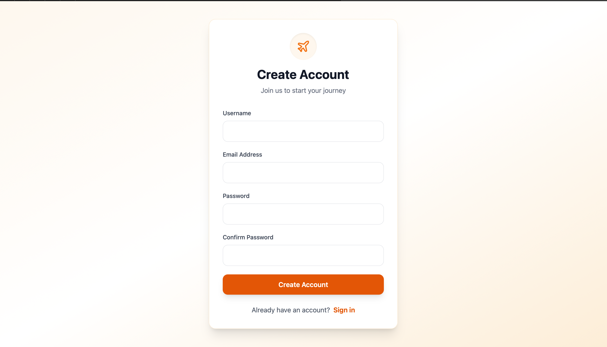

#### Home Page  
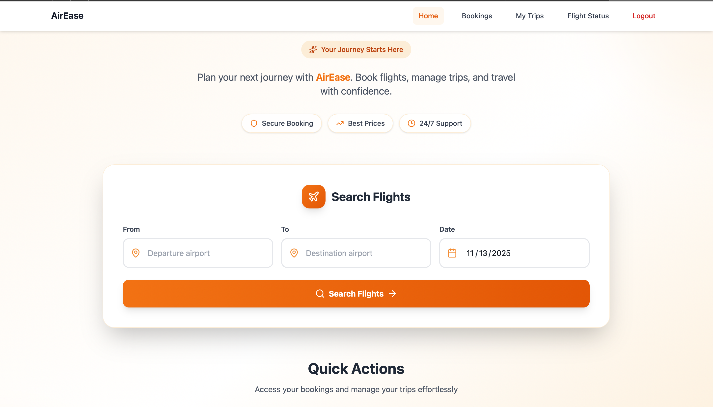

#### Bookings Page  
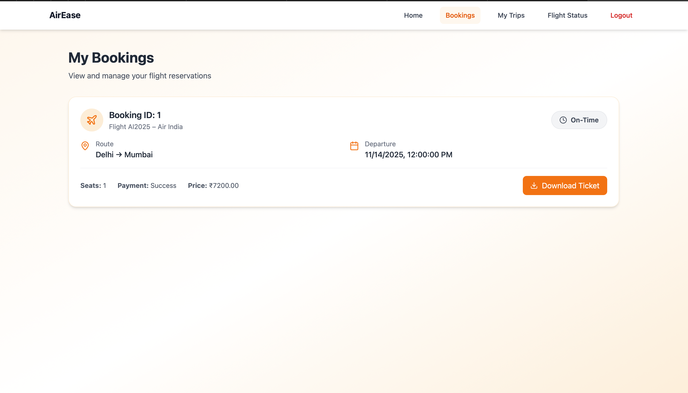

#### My Trips Page  
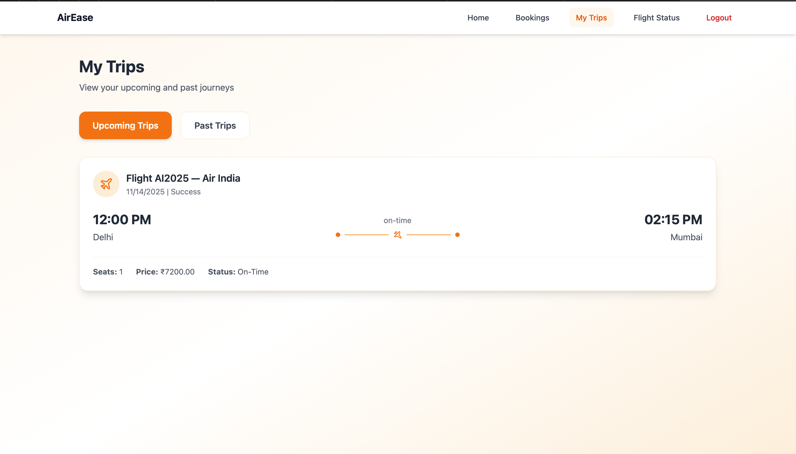

#### Flight Status Page 
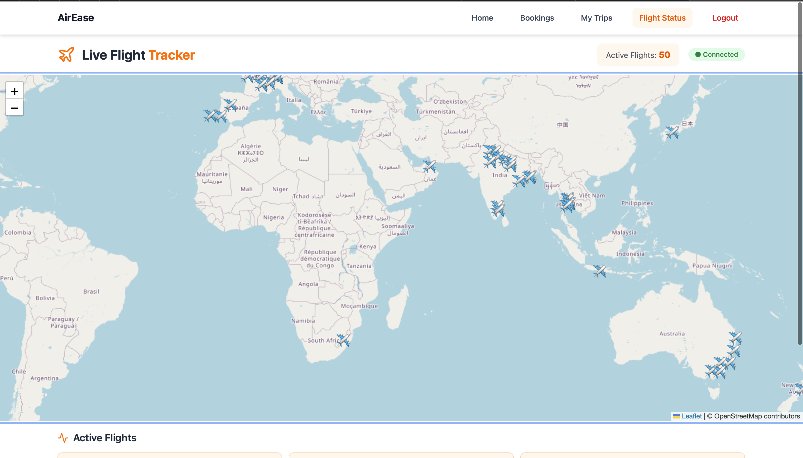

---

### Admin Side

#### Admin Dashboard  
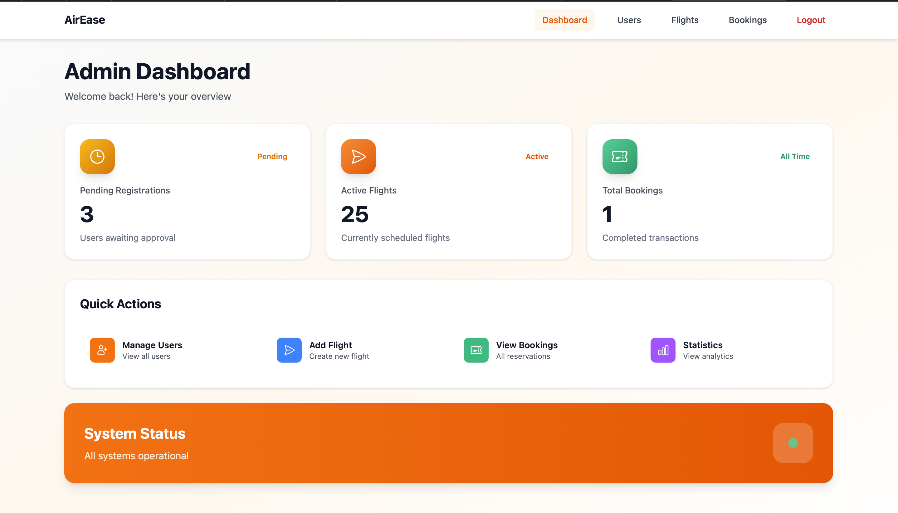

#### User Management  
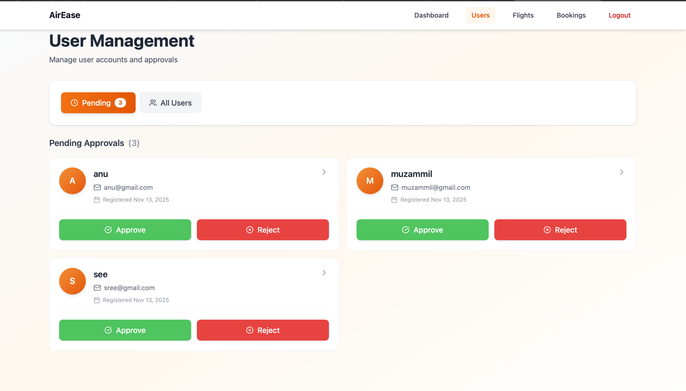

#### Flight Inventory  
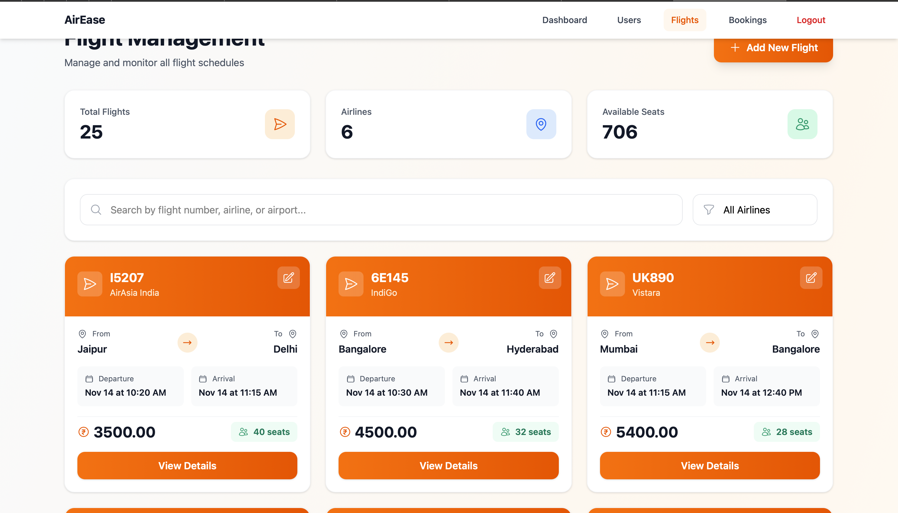

#### Booking Management  
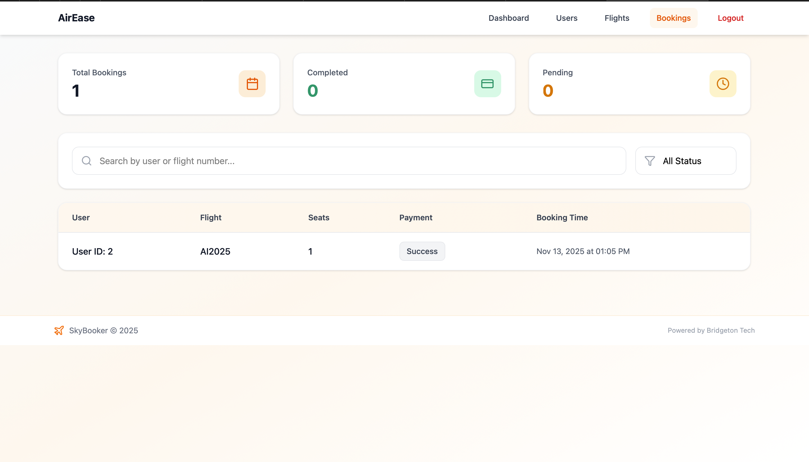


### Objective

This project showcases professional-grade full-stack development practices including:

- Secure REST API design with Django REST Framework
- Modern React frontend with responsive design
- Complex user workflows with approval pipeline
- Real-time data integration with OpenSky Network API
- Production-ready database architecture with proper indexing
- JWT authentication with token refresh mechanism
- OTP-based password reset with 5-minute expiry
- Email notification system for user management

**Repository:** [github.com/rinshafebin/Air-booking-task](https://github.com/rinshafebin/Air-booking-task)

---

## Key Features

### Authentication & User Management

- **User Registration & Admin Approval Workflow:** New users register with pending status; admins review and approve accounts with email notifications
- **Secure Authentication:** JWT-based authentication with token refresh capabilities using Django REST Framework Simple JWT
- **Password Reset:** Users can reset their password via OTP verification (6-digit code valid for 5 minutes)
- **Role-based Access Control:** Separate dashboards and permissions for users and admins
- **Email Notifications:** Automated emails for approval confirmations and password resets

### Flight Management

- **Flight Search & Filtering:** Search flights by departure/arrival airports and date with comprehensive filtering
- **Real-time Flight Status:** Live flight status using OpenSky Network API with ICAO24 code integration
- **Booking Management:** Create, view, and manage flight bookings with payment simulation
- **My Trips Section:** Users can track all bookings with real-time flight status updates
- **Flight Inventory Management:** Admin can add and update flight information

### Admin Capabilities

- **Admin Dashboard:** Manage users, flights, and monitor booking statistics
- **Pending User Management:** Approve/reject pending user registrations with email notifications
- **Booking Analytics:** View total bookings, revenue, and success rates
- **User Approval Workflow:** Streamlined process for managing new user registrations

### User Experience

- **Responsive Design:** Mobile-friendly interface built with React and Tailwind CSS
- **Real-time Updates:** Live flight status updates using OpenSky API
- **Intuitive Navigation:** Clear user workflows with step-by-step guidance
- **Error Handling:** Comprehensive error messages and handling

---

##  Tech Stack

### Backend

| Component | Technology | Version |
|-----------|------------|---------|
| **Framework** | Django + Django REST Framework | 4.2 |
| **Authentication** | Simple JWT | 5.2.2 |
| **Database** | PostgreSQL | 12+ |
| **ORM** | Django ORM | Built-in |
| **Email** | Django Email Backend | SMTP |
| **Task Queue** | Celery | 5.2.7 (Optional) |
| **API Docs** | DRF Browsable API | Built-in |
| **Runtime** | Python | 3.9+ |

### Frontend

| Component | Technology | Version |
|-----------|------------|---------|
| **Library** | React | 18.2.0 |
| **Routing** | React Router | v6.8.0 |
| **HTTP Client** | Axios | 1.3.0 |
| **Styling** | Tailwind CSS | 3.2.4 |
| **UI Components** | React Components | Custom |
| **Build Tool** | Vite | 4.1.0 |

### Infrastructure

| Service | Purpose |
|---------|---------|
| **Database** | PostgreSQL 12+ with proper indexing |
| **Web Server** | Gunicorn (production) / Django Dev Server |
| **Reverse Proxy** | Nginx (production) |
| **Email** | SMTP / SendGrid (optional) |

---

## 🔌 External APIs

| Service | Provider | Purpose | Integration |
|---------|----------|---------|-------------|
| **Flight Status** | OpenSky Network | Real-time flight tracking | ICAO24 code matching |
| **Email Service** | SMTP | User notifications | Approval confirmations |
| **Password Reset** | Internal OTP | Secure password reset | 5-minute expiry |

---

##  Installation Guide

### Prerequisites

Before you begin, ensure you have the following installed:

- **Python** 3.9 or higher
- **Node.js** 16+ and npm
- **PostgreSQL** 12 or higher
- **Git** version control
- **pip** (Python package manager)

<details>
<summary><strong>Platform-specific Prerequisites</strong></summary>

**macOS:**
```bash
# Install Homebrew (if not already installed)
/bin/bash -c "$(curl -fsSL https://raw.githubusercontent.com/Homebrew/install/HEAD/install.sh)"

# Install dependencies
brew install python node postgresql git
```

**Linux (Ubuntu/Debian):**
```bash
sudo apt-get update
sudo apt-get install python3.9 python3-pip nodejs npm postgresql postgresql-contrib git
```

**Windows:**
- Download and install Python from [python.org](https://www.python.org/downloads/)
- Download and install Node.js from [nodejs.org](https://nodejs.org/)
- Download and install PostgreSQL from [postgresql.org](https://www.postgresql.org/download/)
- Download and install Git from [git-scm.com](https://git-scm.com/)

</details>

---

##  Backend Setup

### Step 1: Clone the Repository

```bash
git clone https://github.com/rinshafebin/Air-booking-task.git
cd Air-booking-task/backend
```

### Step 2: Create Virtual Environment

```bash
# Create virtual environment
python -m venv venv

# Activate virtual environment
source venv/bin/activate          # macOS/Linux
# venv\Scripts\activate           # Windows (Command Prompt)
# . venv\Scripts\Activate.ps1     # Windows (PowerShell)
```

### Step 3: Install Dependencies

```bash
pip install -r requirements.txt
```

### Step 4: Configure Environment Variables

```bash
# Copy example environment file
cp .env.example .env

# Edit .env file with your configuration
nano .env  # or use your preferred editor
```

### Step 5: Setup PostgreSQL Database

```bash
# Create database
createdb airbooking_db

# Run migrations
python manage.py migrate

# Create superuser (admin account)
python manage.py createsuperuser
```

<details>
<summary><strong>Database Setup Alternatives</strong></summary>

**PostgreSQL on macOS (via Homebrew):**
```bash
brew services start postgresql
createdb airbooking_db
```

**PostgreSQL on Linux:**
```bash
sudo service postgresql start
sudo -u postgres createdb airbooking_db
```

**Windows (using psql):**
```bash
psql -U postgres
CREATE DATABASE airbooking_db;
\q
```

</details>

### Step 6: Run Development Server

```bash
python manage.py runserver
```

**Backend runs at:** `http://localhost:8000`

**API Documentation:** `http://localhost:8000/api/`

---

##  Frontend Setup (Vite)

### Step 1: Navigate to Frontend Directory

```bash
cd ../frontend
```

### Step 2: Install Dependencies

```bash
npm install
```

### Step 3: Configure Environment Variables

```bash
# Copy example environment file
cp .env.example .env.local

# Edit .env.local with your configuration
nano .env.local
```

### Step 4: Start Development Server

```bash
npm run dev
```

**Frontend runs at:** `http://localhost:5173`

### Step 5: Build for Production

```bash
npm run build
```

This generates a `dist/` folder for deployment.

---

##  Environment Configuration

### Backend Configuration (.env)

Create a `.env` file in the backend directory:

```env
# Django Settings
SECRET_KEY=your-django-secret-key-here-make-it-strong
DEBUG=True
ALLOWED_HOSTS=127.0.0.1,localhost

# Database Configuration
DB_ENGINE=django.db.backends.postgresql
DB_NAME=airbooking_db
DB_USER=your_postgres_user
DB_PASSWORD=your_postgres_password
DB_HOST=localhost
DB_PORT=5432

# JWT Configuration
JWT_SECRET_KEY=your-jwt-secret-key-here
JWT_ALGORITHM=HS256
ACCESS_TOKEN_LIFETIME_DAYS=1
REFRESH_TOKEN_LIFETIME_DAYS=7

# OpenSky API Credentials
OPENSKY_USERNAME=your-opensky-username
OPENSKY_PASSWORD=your-opensky-password

# Email Configuration (Optional)
EMAIL_BACKEND=django.core.mail.backends.smtp.EmailBackend
EMAIL_HOST=smtp.gmail.com
EMAIL_PORT=587
EMAIL_USE_TLS=True
EMAIL_HOST_USER=your-email@gmail.com
EMAIL_HOST_PASSWORD=your-app-password

# CORS Settings
CORS_ALLOWED_ORIGINS=http://localhost:5173,http://localhost:3000
```

### Frontend Configuration (.env.local)

Create a `.env.local` file in the frontend directory:

```env
# API Configuration
VITE_API_BASE_URL=http://localhost:8000/api
VITE_JWT_TOKEN_KEY=access_token

# Flight Status API
VITE_OPENSKY_API_BASE=https://opensky-network.org/api
```

---

##  Usage Instructions

### Running the Full Stack Application

1. **Start Backend Server:**
   ```bash
   cd backend
   source venv/bin/activate
   python manage.py runserver
   ```

2. **In a new terminal, start Frontend Server:**
   ```bash
   cd frontend
   npm run dev
   ```

3. **Access the Application:**
   - Frontend: `http://localhost:5173`
   - Backend API: `http://localhost:8000/api`
   - Admin Panel: `http://localhost:8000/admin`

### User Registration Workflow

1. Navigate to the registration page
2. Enter email, password, and personal information
3. Submit registration (status: **pending**)
4. Admin reviews and approves via admin dashboard
5. User receives confirmation email
6. Login with approved credentials

### Booking a Flight

1. Login to your account (must be approved)
2. Navigate to flight search
3. Enter departure/arrival airports and date
4. Filter flights by price, airline, time
5. Select a flight and click "Book"
6. Confirm number of seats
7. Complete payment simulation
8. View booking confirmation
9. Track flight status in "My Trips"

### Admin Operations

1. Navigate to `http://localhost:8000/admin`
2. Login with superuser credentials
3. Approve pending user registrations
4. View booking statistics and revenue
5. Manage flight inventory
6. Update flight status manually

---

##  API Documentation

### Authentication Endpoints

**Register User**
```
POST /api/auth/register/
Content-Type: application/json

{
  "username": "John",
  "email": "user@example.com",
  "password": "securepass123",
  "confirm_password": "securepass123"
}
```

**Response (201 Created):**
```json
{
  "id": 1,
  "username": "John",
  "email": "user@example.com",
  "approval_status": "pending",
  "message": "Registration successful. Awaiting admin approval."
}
```

---

**Login**
```
POST /api/auth/login/
Content-Type: application/json

{
  "email": "user@example.com",
  "password": "securepass123"
}
```

**Response (200 OK):**
```json
{
  "access": "eyJ0eXAiOiJKV1QiLCJhbGc...",
  "refresh": "eyJ0eXAiOiJKV1QiLCJhbGc..."
}
```

---

**Refresh Token**
```
POST /api/auth/refresh/
Content-Type: application/json

{
  "refresh": "your-refresh-token"
}
```

**Response (200 OK):**
```json
{
  "access": "new-access-token"
}
```

---

**Request Password Reset**
```
POST /api/auth/forget-password/
Content-Type: application/json

{
  "email": "user@example.com"
}
```

**Response (200 OK):**
```json
{
  "message": "OTP sent to your email. Valid for 5 minutes."
}
```

---

**Reset Password with OTP**
```
POST /api/auth/reset-password/
Content-Type: application/json

{
  "email": "user@example.com",
  "otp": "123456",
  "new_password": "newStrongPassword123"
}
```

**Response (200 OK):**
```json
{
  "message": "Password reset successfully"
}
```


---

### Flight Endpoints

**List All Flights**
```
GET /api/flights/?departure_airport=JFK&arrival_airport=LAS&departure_time=2025-12-25
Authorization: Bearer {access_token}
```

**Query Parameters:**
```
- departure_airport: IATA code (JFK, LAX, etc.)
- arrival_airport: IATA code
- departure_time: Date (YYYY-MM-DD)
- status: on-time, delayed, cancelled
```

**Response (200 OK):**
```json
{
  "count": 25,
  "next": "http://localhost:8000/api/flights/?page=2",
  "previous": null,
  "results": [
    {
      "id": 1,
      "flight_number": "UA123",
      "airline": "United Airlines",
      "departure_airport": "JFK",
      "arrival_airport": "LAS",
      "departure_time": "2025-12-25T10:00:00Z",
      "arrival_time": "2025-12-25T13:00:00Z",
      "available_seats": 50,
      "price": "299.99",
      "status": "on-time",
      "icao24": "A12345"
    }
  ]
}
```

---

**Get Flight Details**
```
GET /api/flights/{id}/
Authorization: Bearer {access_token}
```

**Response (200 OK):**
```json
{
  "id": 1,
  "flight_number": "UA123",
  "airline": "United Airlines",
  "departure_airport": "JFK",
  "arrival_airport": "LAS",
  "departure_time": "2025-12-25T10:00:00Z",
  "arrival_time": "2025-12-25T13:00:00Z",
  "available_seats": 50,
  "price": "299.99",
  "status": "on-time",
  "icao24": "A12345"
}
```

---


### Booking Endpoints

**Create Booking**
```
POST /api/bookings/
Content-Type: application/json
Authorization: Bearer {access_token}

{
  "flight_id": 1,
  "seats": 2
}
```

**Response (201 Created):**
```json
{
  "id": 101,
  "user_id": 5,
  "flight_id": 1,
  "seats": 2,
  "payment_status": "Pending",
  "created_at": "2025-11-13T06:30:00Z",
  "updated_at": "2025-11-13T06:30:00Z"
}
```

---

**Get User Bookings**
```
GET /api/bookings/
Authorization: Bearer {access_token}
```

**Response (200 OK):**
```json
{
  "count": 3,
  "results": [
    {
      "id": 101,
      "flight": {
        "flight_number": "UA123",
        "departure_airport": "JFK",
        "arrival_airport": "LAS",
        "departure_time": "2025-12-25T10:00:00Z"
      },
      "seats": 2,
      "payment_status": "Success",
      "created_at": "2025-11-13T06:30:00Z"
    }
  ]
}
```

---

**Get Booking Details**
```
GET /api/bookings/{id}/
Authorization: Bearer {access_token}
```

**Response (200 OK):**
```json
{
  "id": 101,
  "user": {
    "id": 5,
    "email": "user@example.com",
    "username": "john"
  },
  "flight": {
    "flight_number": "UA123",
    "airline": "United Airlines",
    "departure_airport": "JFK",
    "arrival_airport": "LAS",
    "departure_time": "2025-12-25T10:00:00Z",
    "arrival_time": "2025-12-25T13:00:00Z"
  },
  "seats": 2,
  "payment_status": "Success",
  "created_at": "2025-11-13T06:30:00Z",
  "updated_at": "2025-11-13T06:30:00Z"
}
```


---
**Get full API Documentation:** `http://localhost:8000/api/`

---

##  Database Schema

### User Model

**Table:** `auth_user` (Custom AbstractUser)

| Field | Type | Constraints | Description |
|-------|------|-------------|-------------|
| `id` | AutoField | PK, Auto-increment | User unique identifier |
| `username` | CharField(150) | UNIQUE, NOT NULL | Unique username |
| `email` | EmailField | UNIQUE, NOT NULL | User email address |
| `password` | CharField | NOT NULL | Hashed (PBKDF2) |
| `first_name` | CharField(150) | NULL | User's first name |
| `last_name` | CharField(150) | NULL | User's last name |
| `approval_status` | CharField(10) | DEFAULT='pending' | pending/approved/rejected |
| `is_staff` | BooleanField | DEFAULT=False | Admin flag |
| `is_active` | BooleanField | DEFAULT=True | Account active |
| `is_superuser` | BooleanField | DEFAULT=False | Superuser flag |
| `created_at` | DateTimeField | auto_now_add | Registration timestamp |
| `updated_at` | DateTimeField | auto_now | Last update timestamp |
| `email_sent` | BooleanField | DEFAULT=False | Email sent flag |
| `last_login` | DateTimeField | NULL | Last login time |
| `date_joined` | DateTimeField | NOT NULL | Join date |

**Indexes:** `email`, `username`, `approval_status`, `created_at`

**Key Features:**
- Login with email (not username)
- `@property is_approved` → Returns `approval_status == 'approved'`
- Auto-timestamps for tracking

---

### Flight Model

**Table:** `flights_flight`

| Field | Type | Constraints | Description |
|-------|------|-------------|-------------|
| `id` | AutoField | PK, Auto-increment | Flight ID |
| `flight_number` | CharField(10) | UNIQUE, NOT NULL | Flight code |
| `airline` | CharField(50) | NOT NULL | Airline name |
| `departure_airport` | CharField(50) | NOT NULL, INDEX | Departure IATA |
| `arrival_airport` | CharField(50) | NOT NULL, INDEX | Arrival IATA |
| `departure_time` | DateTimeField | NOT NULL, INDEX | Departure time |
| `arrival_time` | DateTimeField | NOT NULL | Arrival time |
| `price` | DecimalField(8,2) | NOT NULL | Ticket price |
| `available_seats` | PositiveIntegerField | NOT NULL | Available seats |
| `status` | CharField(10) | DEFAULT='on-time' | Flight status |
| `icao24` | CharField(6) | NULL, BLANK | OpenSky API code |

**Status Values:** `on-time`, `delayed`, `cancelled`

**Indexes:** `departure_airport`, `arrival_airport`, `departure_time`

**Ordering:** `departure_time` (ascending)

**Key Features:**
- ICAO24 code for OpenSky Network integration
- Decimal price with 2 decimal places (max: 999,999.99)
- Indexed by route and time for fast queries

---

### Booking Model

**Table:** `bookings_booking`

| Field | Type | Constraints | Description |
|-------|------|-------------|-------------|
| `id` | AutoField | PK, Auto-increment | Booking ID |
| `user_id` | ForeignKey | FK, CASCADE | Reference to User |
| `flight_id` | ForeignKey | FK, CASCADE | Reference to Flight |
| `seats` | PositiveIntegerField | DEFAULT=1 | Seats booked |
| `payment_status` | CharField(10) | DEFAULT='Pending' | Payment status |
| `created_at` | DateTimeField | auto_now_add, INDEX | Booking time |
| `updated_at` | DateTimeField | auto_now | Update time |

**Payment Status Values:** `Pending`, `Success`, `Failed`

**Unique Constraint:** `(user_id, flight_id)` - One booking per user per flight

**Indexes:** `created_at`, `payment_status`

**Ordering:** `-created_at` (newest first)

**Related Names:**
- From User: `user.bookings.all()`
- From Flight: `flight.bookings.all()`

---

### OTP Model

**Table:** `otp`

| Field | Type | Constraints | Description |
|-------|------|-------------|-------------|
| `id` | AutoField | PK, Auto-increment | OTP ID |
| `user_id` | ForeignKey | FK, CASCADE | Reference to User |
| `code` | CharField(6) | NOT NULL, INDEX | 6-digit OTP |
| `created_at` | DateTimeField | auto_now_add | Creation time |
| `is_used` | BooleanField | DEFAULT=False, INDEX | Usage status |

**Methods:**
- `is_expired()` → Returns `True` if > 5 minutes old
- `mark_used()` → Sets `is_used = True` and saves

**Indexes:** `user_id`, `code`, `is_used`

**OTP Validity:** 5 minutes from creation

**Ordering:** `-created_at` (newest first)

---

### Relationship Diagram

```
User (1)
  ├──────────────────────┐
  │                      │
  │ (Foreign Key)   (Foreign Key)
  │                      │
  ▼                      ▼
Booking (Many)          OTP (Many)
  │
  ├─────────────────────────┐
  │                         │
  │ (Foreign Key)      (cascade delete)
  │                         │
  ▼                         ▼
Flight (1)             Bookings cleaned


Flight (1)
  │
  │ (Foreign Key)
  │
  ▼
Booking (Many)
```

---

### Database Operations

**User Approval Workflow**
```python
# 1. User registers (auto status = 'pending')
user = User.objects.create_user(
    email='user@example.com',
    username='user123'
)

# 2. Admin approves
user.approval_status = 'approved'
user.email_sent = True
user.save()

# 3. Check approval
if user.is_approved:
    # Allow login
```

**Flight Search & Booking**
```python
# 1. Search flights by route and date
flights = Flight.objects.filter(
    departure_airport='JFK',
    arrival_airport='LAS',
    departure_time__date=date,
    status='on-time'
).order_by('departure_time')

# 2. Create booking
booking = Booking.objects.create(
    user=user,
    flight=flight,
    seats=2
)

# 3. Get user bookings
user_bookings = user.bookings.all()
```

**OTP Management**
```python
# 1. Create OTP
otp = OTP.objects.create(user=user, code='123456')

# 2. Verify OTP (not expired and not used)
otp_obj = OTP.objects.filter(
    user=user,
    code=code,
    is_used=False
).first()

if otp_obj and not otp_obj.is_expired():
    otp_obj.mark_used()
    # Allow password reset
```

---

## 🧪 Testing & Admin Credentials

### Creating Test Accounts

After running migrations, create a superuser account:

```bash
python manage.py createsuperuser
```

### Sample Test Credentials

**Admin Account:**
```
Email: admin@example.com
Password: Admin@123456
```

**Test User Account (Requires Approval):**
```
Email: testuser@example.com
Password: TestUser@123456
```

### Quick Testing Guide

**1. Register as New User:**
- Navigate to `http://localhost:5173/register`
- Email: `testuser@example.com`
- Password: `TestUser@123456`
- Submit (status will be **pending**)

**2. Approve User as Admin:**
- Navigate to `http://localhost:8000/admin`
- Login with admin credentials
- Go to Users section
- Click "Approve" next to test user
- User receives confirmation email

**3. Login and Book Flight:**
- Navigate to `http://localhost:5173/login`
- Login with test user credentials
- Search for flights
- Complete booking
- Check "My Trips" for details

**4. View Admin Dashboard:**
- Navigate to `http://localhost:8000/admin`
- View booking statistics
- Monitor pending users

### Access Points

| Interface | URL | Login With |
|-----------|-----|-----------|
| **Admin Panel** | `http://localhost:8000/admin` | Admin account |
| **API Docs** | `http://localhost:8000/api/` | Any valid token |
| **Frontend** | `http://localhost:5173` | Any user account |

---

### Common Error Codes

| Error Code | HTTP Status | Description |
|-----------|-------------|-------------|
| `invalid_credentials` | 401 | Email or password incorrect |
| `user_not_approved` | 403 | User account pending admin approval |
| `token_expired` | 401 | JWT token has expired |
| `insufficient_seats` | 400 | Flight has no available seats |
| `booking_not_found` | 404 | Booking ID doesn't exist |
| `flight_not_found` | 404 | Flight ID doesn't exist |
| `user_not_found` | 404 | User account not found |
| `duplicate_email` | 400 | Email already registered |
| `invalid_otp` | 400 | OTP code is incorrect or expired |

---

## 🔧 Troubleshooting

### Backend Issues

**PostgreSQL Connection Error**
```bash
# Check PostgreSQL status
sudo service postgresql status

# Start PostgreSQL
sudo service postgresql start

# Create database
createdb airbooking_db

# Run migrations
python manage.py migrate
```

**Port 8000 Already in Use**
```bash
# Run on different port
python manage.py runserver 8001

# Or kill process using port 8000
lsof -ti:8000 | xargs kill -9
```

**ModuleNotFoundError**
```bash
# Ensure virtual environment activated
source venv/bin/activate

# Reinstall dependencies
pip install -r requirements.txt
```

**Database Migration Errors**
```bash
# Check migration status
python manage.py showmigrations

# Rollback migrations
python manage.py migrate appname zero

# Reapply migrations
python manage.py migrate
```

### Frontend Issues

**Port 5173 Already in Use**
```bash
# Run on different port
npm run dev -- --port 5174

# Or kill process
lsof -ti:5173 | xargs kill -9
```

**Module Not Found**
```bash
# Clear and reinstall
rm -rf node_modules package-lock.json
npm install
npm run dev
```

**Build Errors**
```bash
# Clear Vite cache
rm -rf dist .vite

# Rebuild
npm run build
```

**CORS Errors**
```
Ensure .env.local has correct API URL:
VITE_API_BASE_URL=http://localhost:8000/api

Ensure .env includes frontend origin:
CORS_ALLOWED_ORIGINS=http://localhost:5173
```

### API Connection Issues

**404 Not Found**
```bash
# Check API is running
curl http://localhost:8000/api/

# Verify endpoint URLs in backend
```

**401 Unauthorized**
```
Check JWT token in Authorization header:
Authorization: Bearer {token}

Use refresh endpoint if token expired
```

---


##  Dependency Versions

### Backend Requirements

```
Django==5.2.8
django-celery-beat==2.8.1
django-cors-headers==4.9.0
django-timezone-field==7.1
djangorestframework==3.16.1
djangorestframework_simplejwt==5.5.1
```

### Frontend Dependencies

```json
{
  "dependencies": {
    "react": "^18.2.0",
    "react-dom": "^18.2.0",
    "react-router-dom": "^6.8.0",
    "axios": "^1.3.0",
    "tailwindcss": "^3.2.4"
  },
  "devDependencies": {
    "vite": "^4.1.0",
    "@vitejs/plugin-react": "^3.1.0",
    "eslint": "^8.33.0"
  }
}
```

---

##  Contributing

Contributions are welcome! Please follow these steps:

1. Fork the repository
2. Create a feature branch (`git checkout -b feature/AmazingFeature`)
3. Commit your changes (`git commit -m 'Add AmazingFeature'`)
4. Push to the branch (`git push origin feature/AmazingFeature`)
5. Open a Pull Request

---

## License

This project is licensed under the MIT License - see the LICENSE file for details.

---

## Contact & Support

For questions, issues, or suggestions:

- **GitHub Issues:** [Create an issue](https://github.com/rinshafebin/Air-booking-task/issues)
- **Email:** rinshafebin@example.com
- **LinkedIn:** [Rinsha Febin](https://www.linkedin.com/in/rinsha-febinkk/)

---

##  Acknowledgments

- Django REST Framework documentation
- React official documentation
- OpenSky Network for flight data
- PostgreSQL documentation
- The open-source community

---

<div align="center">

Made with  by Rinsha Febin

[⬆ Back to Top](#airbooking---full-stack-flight-booking-platform)

</div>
